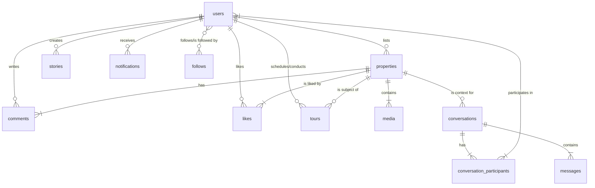

# edQorta Application Backend Schematic

## 1. Introduction

This document provides a comprehensive schematic for the backend development of the edQorta application. It is intended for backend developers to understand the data models, relationships, business logic, and API requirements necessary to support the existing frontend application.

The application is a social real estate marketplace with features for property listings, user verification, social interactions (posts, stories, likes, comments), a full-featured chat system, and community hubs.

---

## 2. Database Schema & Core Entities

The following tables represent the core entities of the application. SQL-like syntax is used for clarity. `PRIMARY KEY` is assumed to be an auto-incrementing integer (`id`) unless specified otherwise. Timestamps (`created_at`, `updated_at`) should be added to all tables.

### 2.1. `users`

Stores all user information, including personal accounts, agents, and business accounts.

```sql
CREATE TABLE users (
    id INT PRIMARY KEY AUTO_INCREMENT,
    name VARCHAR(255) NOT NULL,
    username VARCHAR(100) NOT NULL UNIQUE,
    email VARCHAR(255) NOT NULL UNIQUE,
    phone_number VARCHAR(20) UNIQUE,
    password_hash VARCHAR(255) NOT NULL,
    avatar_url VARCHAR(255),
    banner_url VARCHAR(255),
    bio TEXT,
    location VARCHAR(255),
    is_private BOOLEAN DEFAULT FALSE,

    -- Account Type --
    account_type ENUM('personal', 'business') NOT NULL DEFAULT 'personal',

    -- Agent Status --
    agent_status ENUM('none', 'pending', 'verified') NOT NULL DEFAULT 'none',

    -- Business Status --
    business_status ENUM('none', 'pending', 'verified') NOT NULL DEFAULT 'none',
    business_type ENUM('agency', 'hotel', 'shortlet', 'other'),

    -- Verified Lister Status (for personal accounts) --
    lister_status ENUM('unverified', 'verified') NOT NULL DEFAULT 'unverified',
    
    trust_score DECIMAL(3, 1) DEFAULT 5.0,
    referral_code VARCHAR(50) UNIQUE,

    created_at TIMESTAMP DEFAULT CURRENT_TIMESTAMP,
    updated_at TIMESTAMP DEFAULT CURRENT_TIMESTAMP ON UPDATE CURRENT_TIMESTAMP
);
```

### 2.2. `properties`

This is a versatile table that stores both "property" listings and "normal" social posts.

```sql
CREATE TABLE properties (
    id INT PRIMARY KEY AUTO_INCREMENT,
    lister_id INT NOT NULL,
    post_type ENUM('property', 'normal') NOT NULL,
    description TEXT NOT NULL,
    timestamp TIMESTAMP DEFAULT CURRENT_TIMESTAMP,
    
    -- Property-specific fields (NULL for 'normal' posts) --
    price DECIMAL(15, 2),
    price_interval ENUM('year', 'month', 'week', 'day', 'night'),
    listing_type ENUM('rent', 'sale'),
    location VARCHAR(255),
    latitude DECIMAL(10, 8),
    longitude DECIMAL(11, 8),
    beds INT,
    baths INT,
    is_available BOOLEAN DEFAULT TRUE, -- For hotels/shortlets
    neighborhood_id INT,

    -- Verification --
    verification_status ENUM('unverified', 'pending', 'verified') DEFAULT 'unverified',
    verifier_id INT, -- agent who verified it
    verification_fee DECIMAL(10, 2),
    verification_assigned_at TIMESTAMP,
    verification_completed_at TIMESTAMP,

    FOREIGN KEY (lister_id) REFERENCES users(id) ON DELETE CASCADE,
    FOREIGN KEY (verifier_id) REFERENCES users(id) ON DELETE SET NULL,
    FOREIGN KEY (neighborhood_id) REFERENCES neighborhoods(id) ON DELETE SET NULL
);
```

### 2.3. `media`

Stores references to all media files (images, videos) associated with a property/post.

```sql
CREATE TABLE media (
    id INT PRIMARY KEY AUTO_INCREMENT,
    property_id INT NOT NULL,
    media_type ENUM('image', 'video') NOT NULL,
    media_url VARCHAR(255) NOT NULL,
    sort_order INT DEFAULT 0,
    FOREIGN KEY (property_id) REFERENCES properties(id) ON DELETE CASCADE
);
```

### 2.4. `stories`

Stores ephemeral user stories. A background job/cron should be set up to delete stories older than 24 hours.

```sql
CREATE TABLE stories (
    id INT PRIMARY KEY AUTO_INCREMENT,
    user_id INT NOT NULL,
    media_type ENUM('image', 'video') NOT NULL,
    media_url VARCHAR(255) NOT NULL,
    duration_seconds INT DEFAULT 5, -- for images
    created_at TIMESTAMP DEFAULT CURRENT_TIMESTAMP,
    FOREIGN KEY (user_id) REFERENCES users(id) ON DELETE CASCADE
);
```

### 2.5. `follows` (Junction Table)

Many-to-Many relationship for users following each other.

```sql
CREATE TABLE follows (
    follower_id INT NOT NULL,
    following_id INT NOT NULL,
    created_at TIMESTAMP DEFAULT CURRENT_TIMESTAMP,
    PRIMARY KEY (follower_id, following_id),
    FOREIGN KEY (follower_id) REFERENCES users(id) ON DELETE CASCADE,
    FOREIGN KEY (following_id) REFERENCES users(id) ON DELETE CASCADE
);
```

### 2.6. `likes` (Junction Table)

Many-to-Many relationship for users liking properties/posts.

```sql
CREATE TABLE likes (
    user_id INT NOT NULL,
    property_id INT NOT NULL,
    created_at TIMESTAMP DEFAULT CURRENT_TIMESTAMP,
    PRIMARY KEY (user_id, property_id),
    FOREIGN KEY (user_id) REFERENCES users(id) ON DELETE CASCADE,
    FOREIGN KEY (property_id) REFERENCES properties(id) ON DELETE CASCADE
);
```

### 2.7. `comments`

Stores comments made on properties/posts.

```sql
CREATE TABLE comments (
    id INT PRIMARY KEY AUTO_INCREMENT,
    property_id INT NOT NULL,
    user_id INT NOT NULL,
    text TEXT NOT NULL,
    created_at TIMESTAMP DEFAULT CURRENT_TIMESTAMP,
    FOREIGN KEY (property_id) REFERENCES properties(id) ON DELETE CASCADE,
    FOREIGN KEY (user_id) REFERENCES users(id) ON DELETE CASCADE
);
```

### 2.8. `conversations` & `messages`

Handles the chat system.

```sql
CREATE TABLE conversations (
    id INT PRIMARY KEY AUTO_INCREMENT,
    property_id INT, -- optional context
    team_id INT, -- optional context
    deal_status ENUM('none', 'payment_pending', 'agreement_pending', 'complete') DEFAULT 'none',
    created_at TIMESTAMP DEFAULT CURRENT_TIMESTAMP,
    FOREIGN KEY (property_id) REFERENCES properties(id) ON DELETE SET NULL
);

CREATE TABLE conversation_participants (
    conversation_id INT NOT NULL,
    user_id INT NOT NULL,
    PRIMARY KEY (conversation_id, user_id),
    FOREIGN KEY (conversation_id) REFERENCES conversations(id) ON DELETE CASCADE,
    FOREIGN KEY (user_id) REFERENCES users(id) ON DELETE CASCADE
);

CREATE TABLE messages (
    id INT PRIMARY KEY AUTO_INCREMENT,
    conversation_id INT NOT NULL,
    sender_id INT NOT NULL, -- 0 for system messages
    text TEXT,
    audio_url VARCHAR(255),
    audio_duration_seconds INT,
    message_type ENUM('user', 'system') NOT NULL DEFAULT 'user',
    created_at TIMESTAMP DEFAULT CURRENT_TIMESTAMP,
    FOREIGN KEY (conversation_id) REFERENCES conversations(id) ON DELETE CASCADE
);
```

### 2.9. `notifications`

Stores in-app notifications for users.

```sql
CREATE TABLE notifications (
    id INT PRIMARY KEY AUTO_INCREMENT,
    user_id INT NOT NULL, -- The recipient of the notification
    message VARCHAR(255) NOT NULL,
    type ENUM('message', 'verification', 'deal', 'follow', 'tour', 'like', 'comment') NOT NULL,
    context_url VARCHAR(255), -- A URL/deep-link for the frontend to navigate to
    is_read BOOLEAN DEFAULT FALSE,
    created_at TIMESTAMP DEFAULT CURRENT_TIMESTAMP,
    FOREIGN KEY (user_id) REFERENCES users(id) ON DELETE CASCADE
);
```

### 2.10. `tours`

Manages property tour schedules.

```sql
CREATE TABLE tours (
    id INT PRIMARY KEY AUTO_INCREMENT,
    property_id INT NOT NULL,
    renter_id INT NOT NULL,
    agent_id INT NOT NULL,
    status ENUM('pending', 'confirmed', 'cancelled', 'completed') NOT NULL DEFAULT 'pending',
    confirmed_time TIMESTAMP,
    created_at TIMESTAMP DEFAULT CURRENT_TIMESTAMP,
    FOREIGN KEY (property_id) REFERENCES properties(id) ON DELETE CASCADE,
    FOREIGN KEY (renter_id) REFERENCES users(id) ON DELETE CASCADE,
    FOREIGN KEY (agent_id) REFERENCES users(id) ON DELETE CASCADE
);
```

---

## 3. Entity Relationship Diagram (ERD)

This Mermaid diagram illustrates the primary relationships between the tables.



---

## 4. Key Business Logic & Flows

### 4.1. Authentication & Onboarding
- **Sign-up**: User registers with phone or email. A verification code is sent. Upon verification, the user sets a password and a new record is created in the `users` table.
- **Login**: User logs in with credentials. A session is created (e.g., using JWT).

### 4.2. Verification System
- **Agent Application**: A user applies to be an agent. Their `agent_status` becomes 'pending'. An admin backend is required to review and approve these, changing the status to 'verified'.
- **Business Application**: Similar flow for businesses. `business_status` becomes 'pending', requiring admin approval.
- **Property Verification**:
    1. A lister posts a property (`verification_status` = 'unverified').
    2. An eligible Agent (`agent_status` = 'verified') can "accept" the verification task.
    3. The `properties` record is updated: `verification_status` -> 'pending', `verifier_id` -> agent's ID.
    4. The backend must enforce a geo-location check on verification submission. The agent's coordinates must be within a small radius (~0.4km) of the property's coordinates.
    5. Upon successful submission, `verification_status` becomes 'verified'.

### 4.3. Content & Social Flow
- **Post Creation**: Endpoint should differentiate between 'property' and 'normal' posts. For property posts, all relevant fields must be validated.
- **Media Uploads**: All media (post images/videos, stories, voice notes) should be uploaded to a cloud storage service (e.g., AWS S3, Cloudinary). The API should handle the file upload, save it to the bucket, and store the resulting URL in the respective database table (`media`, `stories`, `messages`).
- **Feed Generation**:
    - **"For You" Feed**: Fetch `properties` where `lister_id` is in the current user's `following_ids` list. Order by `timestamp` DESC.
    - **"Discover" Feed**: Fetch `properties` with media, potentially excluding those from blocked users. A simple implementation is a randomized list; a more advanced one could use an algorithm.

### 4.4. Chat & Real-time
- **Initiating Chat**: When a user messages a lister about a property, check if a conversation already exists between them for that property. If not, create a new `conversations` record and add both users to `conversation_participants`.
- **Sending Messages**: A new record is added to the `messages` table. This should trigger a real-time event.
- **Real-time Updates**: Use WebSockets (e.g., Socket.io) for instant delivery of messages and notifications. When a message is sent, the backend should emit an event to the specific conversation's "room".

### 4.5. Booking & Deal Flow
- **Tour Scheduling**: A renter requests a tour for a property. A new record is created in the `tours` table with `status` = 'pending'. A notification is sent to the agent. When the agent confirms, the `status` changes to 'confirmed', and a notification is sent to the renter.
- **"Book Now" Flow (for Hotels/Shortlets)**: This is a simplified "deal" flow.
    1. A user clicks "Book Now".
    2. This triggers a state change in the conversation, possibly creating a record in a `bookings` table (or extending the `tours` table).
    3. The property's `is_available` flag should be set to `false`.
    4. The backend should handle payment processing via a third-party gateway (e.g., Stripe, Paystack). The `deal_status` in the `conversations` table can track the state.

---

## 5. API Endpoint Suggestions (RESTful)

### Auth
- `POST /api/auth/register`
- `POST /api/auth/verify-contact`
- `POST /api/auth/login`
- `POST /api/auth/logout`

### Users
- `GET /api/users/me` (Get current user's profile)
- `GET /api/users/:id` (Get another user's profile)
- `PUT /api/users/me` (Update current user's profile)
- `POST /api/users/:id/follow` (Follow/unfollow a user)
- `GET /api/users/:id/followers`
- `GET /api/users/:id/following`

### Properties (Posts)
- `GET /api/feed/foryou` (Get the "For You" feed)
- `GET /api/feed/discover` (Get the "Discover" feed)
- `POST /api/properties` (Create a new post/property)
- `GET /api/properties/:id` (Get a single post)
- `PUT /api/properties/:id` (Update a post)
- `DELETE /api/properties/:id` (Delete a post)
- `POST /api/properties/:id/like` (Like/unlike a post)
- `GET /api/properties/:id/comments`
- `POST /api/properties/:id/comments`

### Stories
- `GET /api/stories` (Get stories from followed users)
- `POST /api/stories` (Upload a new story)

### Conversations & Messages
- `GET /api/conversations` (Get all of the user's conversations)
- `POST /api/conversations` (Start a new conversation)
- `GET /api/conversations/:id/messages`
- `POST /api/conversations/:id/messages` (Send a message - supports multipart for audio)

### Notifications
- `GET /api/notifications`
- `POST /api/notifications/mark-read`

### Verifications & Dashboards
- `POST /api/verifications/apply/agent` (Apply to be an agent)
- `POST /api/verifications/apply/business`
- `GET /api/dashboard/agent` (Get data for agent dashboard)
- `GET /api/dashboard/business`
- `POST /api/verifications/tasks/:propertyId/accept` (Agent accepts a task)
- `POST /api/verifications/tasks/:propertyId/submit` (Agent submits verification, with location data)
- `PUT /api/properties/:id/availability` (Business toggles availability)

### Tours
- `POST /api/tours` (Request a tour)
- `PUT /api/tours/:id/confirm` (Agent confirms a tour)
```